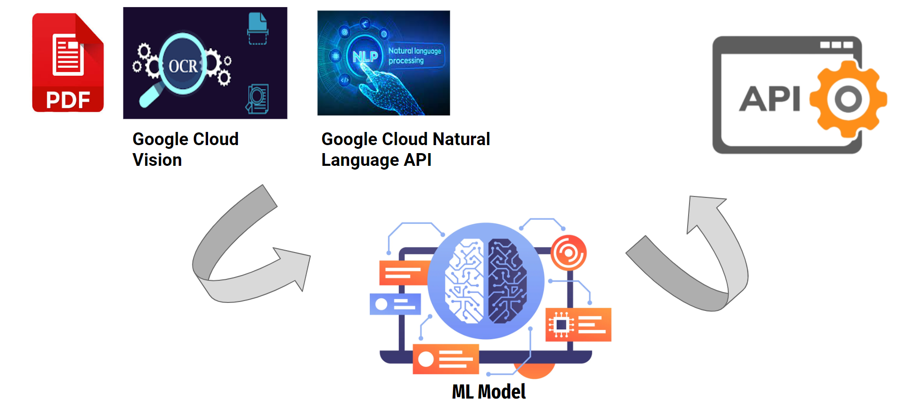
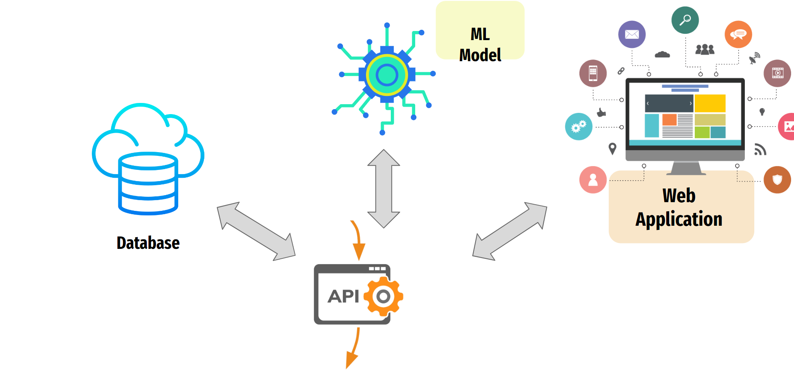
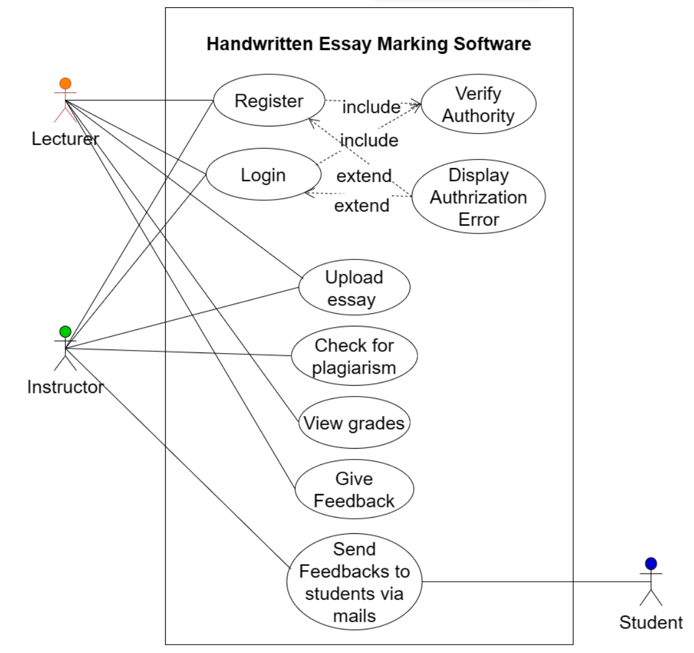

[comment]: # "This is the standard layout for the project, but you can clean this and use your own template"

# Handwritten Essay Marking Software

## Table of Contents
1. [Introduction](#introduction)
2. [Problem](#problem)
3. [Solution](#solution)
4. [Solution Architecture](#solution-architecture)
5. [Use Case Diagram](#use-case-diagram)
6. [Functionalities and Work Flow](#functionalities_and_work_flow)
7. [Technology Stack](#technology-stack)
8. [Dataset](#dataset)
9. [Timeline](#timeline)
10. [Product Owner](#product-owner)
11. [Team](#team)
12. [Links](#links)

   
## Introduction

This innovative tool bridges the gap between traditional pen-and-paper assessments and digital grading systems, offering a seamless and efficient solution for 
evaluating handwritten assignments. Handwritten Essay Marking Software employs cutting-edge optical character recognition (OCR) and machine learning algorithms to
convert handwritten text into digital format, enabling educators to assess and provide feedback on essays electronically. This revolutionary approach not only 
streamlines the grading process but also enhances accuracy, consistency, and accessibility in evaluation.

## Problem

Traditional manual marking is a time-consuming and labor-intensive process, often leading to inefficiencies in grading. Educators spend significant amounts of time
reviewing and evaluating each student's essay, which can be impractical and burdensome. Also, grading is often influenced by the mood or biases of the marker, 
leading to inconsistencies in evaluation. Moreover, as the class size increases, the task becomes more challenging and time-consuming for educators.

## Solution

In the dynamic landscape of education, the demand for efficient and accurate assessment methods has never been greater. Handwritten essay marking software emerges as a transformative solution, leveraging cutting-edge technology to streamline the grading process and provide insightful feedback to both educators and students. This software represents a paradigm shift in assessment methodology, combining advanced algorithms with intuitive user interfaces to revolutionize the way essays are evaluated. This essay explores the inception, functionality, and potential impact of handwritten essay marking software in modern education.

OCR is used to scan the handwritten essays and convert them into digital text. Natural Language Processing is used to identify key features of the essay such as relevance, duplication, grammar, syntax, and vocabulary. A machine learning model will be trained using our dataset when the marker gives an essay it will output the corresponding mark for that essay. 

## Solution Architecture

### Machine Learning Model Creation

To convert the essays into digital texts, Google Cloud Vision which is the tool for OCR is used. Google Cloud Natural Language API is used to extract features from our essay. Those features are used to train our ml model and an API is used to store our data.

### Data Flow

The following image shows the data flow of our system. When the marker uploads an essay it will converted to digital text. Then we give this digital text to our trained ML model and it will give the marks for the essay out of 100. We store those data and the users' data in our database.

## Use Case Diagram

## Functionalities and Work Flow

### Functionalities:
- Develop a machine learning model for automated essay marking by extracting the most relevant useful features.
- Easily get marks and display through a web application.

### Work Flow:

- Data Collection:

Collected a dataset of handwritten essays. This dataset came from students or sources that have handwritten essays available.

- Data Preprocessing and Cleaning:

Converting handwritten essays into digital format using Optical Character Recognition (OCR) technology. OCR helps to extract text from handwritten documents.

- Text Analysis (NLP):

After OCR, we have digital text from handwritten essays. Apply Natural Language Processing (NLP) techniques to process and analyze this text. This involved tasks such as tokenization, stemming, and sentiment analysis. Those extracted features will mostly affect essay marking.

- Machine Learning Model:

Neural network-based model for essay grading. The model takes the preprocessed text data and other features as input and provides essay scores as output.

- Deployment:

Deploy essay grading software as a user-friendly web application. Users can upload handwritten essays, and the software will provide automated marks or grades, making it accessible to educators and students.

## Technology Stack

In today's digitally-driven educational landscape, the demand for efficient and accurate methods of assessing student performance is paramount. Handwritten essay marking software stands as a testament to the convergence of cutting-edge technologies, enabling educators to streamline the grading process and provide constructive feedback to students. This essay delves into the technological foundations of such software, highlighting key components including React, Node.js, Python, TensorFlow, MongoDB Atlas, and Google Cloud Vision.

## Data Set

The dataset that has been used to train the ML model is [The Hewlett Foundation: Automated Essay Scoring Dataset](https://www.kaggle.com/c/asap-aes/data) by ASAP.

## Timeline

## Product Owner
-  Mr. Sampath Deegalla, [sampath@eng.pdn.ac.lk](mailto:sampath@eng.pdn.ac.lk)

## Team
-  E/18/010, Abeywickrama A.K.D.A.S., [e18010@eng.pdn.ac.lk](mailto:e18010@eng.pdn.ac.lk)
-  E/18/156, Jayathilake W.A.T.N., [e18156@eng.pdn.ac.lk](mailto:e18156@eng.pdn.ac.lk)
-  E/18/329, Sewwandi D.W.S.N., [e18329@eng.pdn.ac.lk](mailto:e18329@eng.pdn.ac.lk)

## Links

- [Project Repository](https://github.com/cepdnaclk/e18-6sp-Handwritten_Essay_Marking_Software)
- [Project Page](https://cepdnaclk.github.io/e18-6sp-Handwritten_Essay_Marking_Software/)
- [Department of Computer Engineering](http://www.ce.pdn.ac.lk/)
- [University of Peradeniya](https://eng.pdn.ac.lk/)

[//]: # (Please refer this to learn more about Markdown syntax)
[//]: # (https://github.com/adam-p/markdown-here/wiki/Markdown-Cheatsheet)
